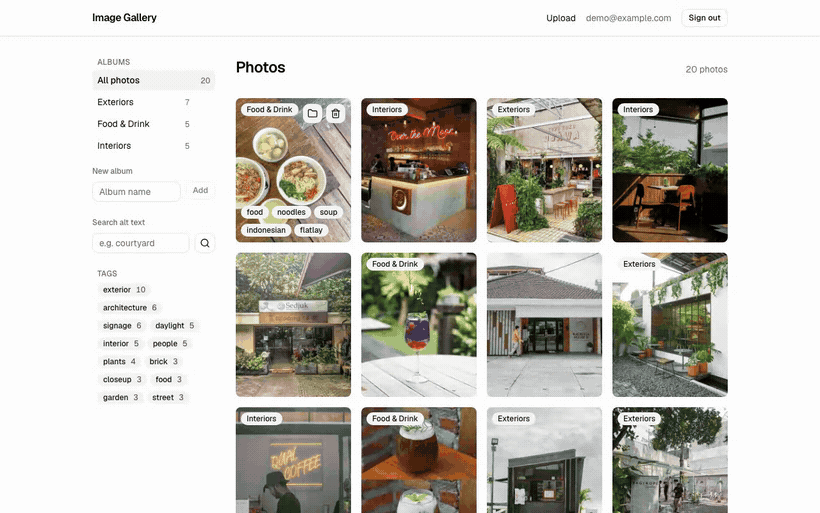

# Image Gallery

Upload a photo, and it is described for screen readers before you ever see it.



## Try it

**Live demo:** _deploying — link here shortly_

| Email              | Password   |
| ------------------ | ---------- |
| `demo@example.com` | `demo1234` |

Registration is disabled on the demo, so the demo account is the way in.

## Why this exists

Most photo apps treat alt text as a field somebody will fill in later, which means nobody
does, which means the photos are invisible to anyone using a screen reader. This one writes it
at upload time: the image goes through Sharp to a resized original and a thumbnail, the
thumbnail goes to a vision model, and the alt text, a one-line description and a handful of
tags come back before the photo appears in the grid. You can edit any of it — but the default
is described rather than blank.

The rest is the ordinary work that makes that useful: albums, drag-to-reorder, tag and
text filtering, and a UI that is entirely operable from the keyboard, drag included.

It is a small app carrying real weight — multipart upload, image processing in a Node runtime,
object storage, and one AI call sitting inside a normal CRUD flow rather than being the product.

## Stack

Next.js 16 (App Router) · React 19 · TypeScript · PostgreSQL + Drizzle · Better Auth ·
Tailwind + shadcn/ui · Cloudflare R2 · Sharp · dnd-kit · Anthropic via the Vercel AI SDK ·
Vitest · Playwright · Docker Compose · GitHub Actions

## Decisions

**The AI call is awaited, not fire-and-forget.** The obvious design returns the photo
immediately and lets the vision call finish in the background. On serverless that quietly
loses data: the function is frozen the moment the response is sent, so a floating promise may
never resolve and the photo is saved with empty metadata. Awaiting costs 2–4 seconds on an
upload the user is already watching a spinner for, and it is the difference between a feature
that works and one that works on your laptop. `describeImage` swallows its own errors, so a
vision failure still saves the photo — just blank, with the form asking you to fill it in.

**Integer positions, not fractional indexing.** Fractional keys exist so concurrent clients
can insert between two items without renumbering. This gallery is single-user with tens of
photos per album, so a reorder rewrites the whole album's positions in one transaction — a
handful of rows. That trades a theoretical write cost I will never pay for one less dependency
and a whole category of key-collision bugs I do not have to reason about. At a thousand
concurrent editors the answer flips; here it is not close.

**The thumbnail bytes go to the model, not a URL.** Sending a link would mean the bucket has
to be publicly readable before the model can look at the file, which makes "is this image
public yet?" a precondition of the upload path. Sending the 400px thumbnail instead is about
40KB on the wire, needs no public bucket, and costs less per call than a full-size image. The
trade is that the model sees a smaller picture — which for alt text is plenty.

**A 4MB upload cap, enforced twice.** Vercel caps serverless request bodies at 4.5MB, so the
limit is the platform's, not a preference. One exported constant is used by both the browser
check and the server check, because the client-side one is a courtesy and the server-side one
is the actual rule. If the app outgrows it the upgrade is a presigned PUT straight to R2 — a
real change in moving parts, deliberately not made in advance.

## Local setup

```bash
pnpm install
cp .env.example .env          # then set BETTER_AUTH_SECRET
docker compose up -d          # Postgres + MinIO
pnpm ensure-bucket
pnpm db:push
pnpm db:seed
pnpm dev
```

No Cloudflare or Anthropic account needed. Compose brings up **MinIO** alongside Postgres and
`.env.example` points the storage variables at it, because R2 is S3-compatible — production
swaps those for real R2 values and drops `R2_ENDPOINT` (see [docs/deploy.md](docs/deploy.md)).

Generate the auth secret with `openssl rand -base64 32`. Uploading needs `ANTHROPIC_API_KEY`
for alt text; without one the upload still succeeds and the fields come back empty for you to
write yourself, which is the same path taken when the vision call fails.

The seed photographs are not distributed with this repository
([seed/CREDITS.md](seed/CREDITS.md)) — without them `pnpm db:seed` generates placeholders, so a
fresh clone still gets a working gallery with real albums, tags and alt text.

## Accessibility

This is the part the project is actually about, so it is tested rather than claimed. Every
push runs axe over the gallery, the upload page, an album page, an open lightbox and an open
menu, failing on any serious or critical violation — alongside a second suite that drives every
flow with the keyboard alone and never calls `click()`.

- **Everything works without a mouse:** login, upload, editing metadata, album create / rename
  / delete, moving a photo between albums, reordering, the lightbox, and delete. A skip link is
  the first stop on the page, and controls that stay visually quiet until hover are still
  reachable by Tab and fully visible once focused.
- **Drag-to-reorder is keyboard-operable** through dnd-kit's keyboard sensor — `Space` to pick
  up, arrows to move, `Space` to drop, `Esc` to cancel — announcing each pick-up, move and drop
  through a live region.
- **The lightbox** traps focus, closes on `Esc`, returns focus to the card that opened it, and
  moves between photos with `←` / `→`.
- **Alt text** is what the AI call is for: every thumbnail carries the stored text, and a photo
  whose alt text is empty shows a visible "Add alt text" badge to its owner rather than failing
  silently.
- **`prefers-reduced-motion`** removes dialog, menu and skeleton animation, and drops the
  transform transition during a drag.

## Scripts

| Script                   | What it does                       |
| ------------------------ | ---------------------------------- |
| `pnpm dev`               | dev server                         |
| `pnpm build`             | production build                   |
| `pnpm lint`              | eslint                             |
| `pnpm typecheck`         | `next typegen` then `tsc --noEmit` |
| `pnpm test`              | vitest                             |
| `pnpm test:e2e`          | playwright                         |
| `pnpm db:push`           | push schema                        |
| `pnpm db:seed`           | demo user + photos                 |
| `pnpm ensure-bucket`     | create the local MinIO bucket      |
| `pnpm verify:production` | check a deployment's demo guards   |

Before the first `pnpm test:e2e`, install the browser once with
`pnpm exec playwright install chromium`, and run `pnpm db:seed` — the end-to-end suite signs in
as the demo account and rearranges a seeded album.

## CI

[`.github/workflows/ci.yml`](.github/workflows/ci.yml) runs lint, typecheck and Vitest in one
job, and Playwright against a production build in another, with Postgres and MinIO as
containers. It holds no credentials: MinIO stands in for R2, and a stubbed vision call keeps
the end-to-end run deterministic and free.
